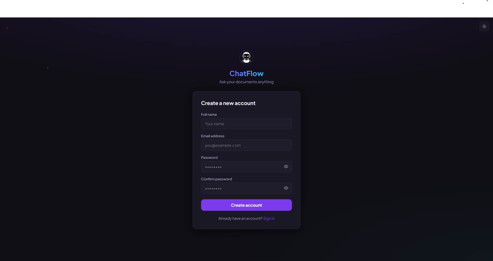
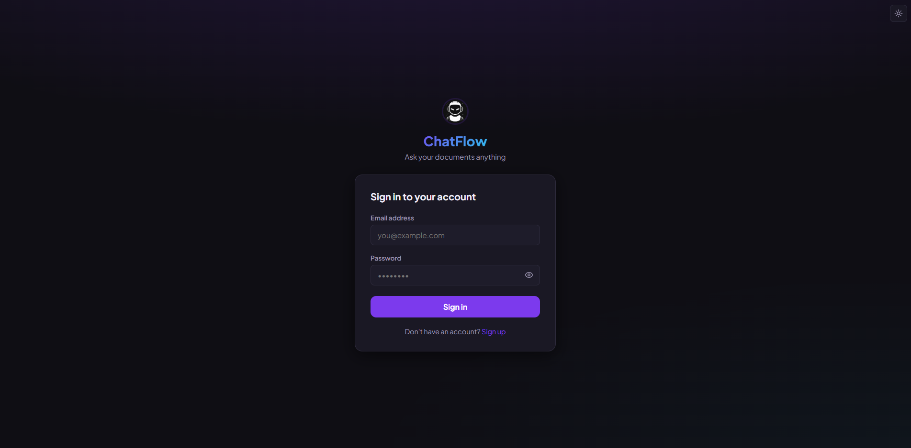
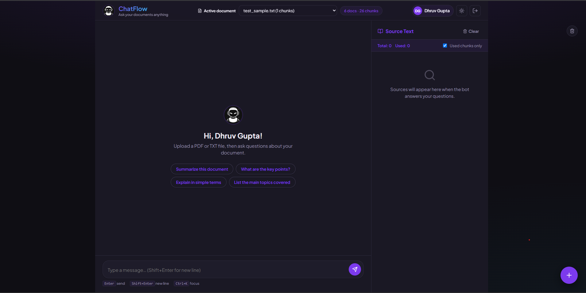
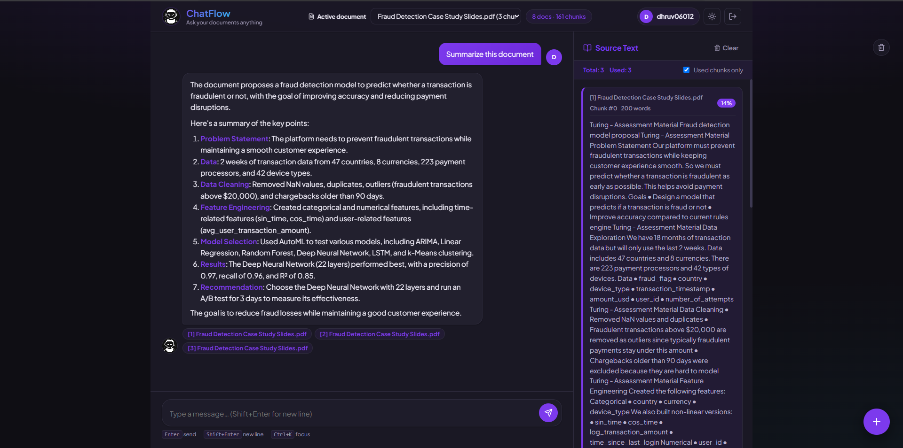

# RAG Chatbot

A polished document-based AI chat app. Upload a PDF or TXT file, then ask smart questions and get answers with exact source support.

[Live demo](https://rag-chatflow-dhruv0126.onrender.com) • [Run locally](#quick-start)

---

## What makes it special
- Fast document conversion to searchable chunks
- Semantic search with local embeddings
- Smooth chat UI with source references
- Persistent ChromaDB storage for document history

---

## Visual tour
<table>
  <tr>
    <td></td>
    <td></td>
  </tr>
  <tr>
    <td></td>
    <td></td>
  </tr>
</table>

**Quick look:** register, log in, upload a document, then ask questions in the chat.

---

## Quick Start

1. Create your Python environment:
```bash
python -m venv .venv
.venv\Scripts\activate
```
2. Install dependencies:
```bash
pip install -r requirements.txt
```
3. Set required environment variables:
```bash
set GROQ_API_KEY=your_api_key
set SECRET_KEY=your_secret_key
```
4. Start the app:
```bash
python app.py
```

## Production launch
```bash
gunicorn --config gunicorn_config.py app:app
```

---

## How it works
1. Upload PDF or TXT
2. The app converts text into embeddings
3. Query the document with natural language
4. Receive an answer plus source chunks

---

## Key features
- **Document upload:** PDF and text files supported
- **Semantic search:** find the best answer using embeddings
- **AI response:** Groq chat generation creates answers
- **Authentication:** secure registration and login
- **Source trace:** response includes document context

---

## Deployment notes
- Never commit `.env`
- Use Render or a similar cloud host
- Add `GROQ_API_KEY` and `SECRET_KEY` to environment variables
- Mount persistent storage to `chroma_db` for embeddings

---

## Use it in 4 steps
- Upload a document
- Choose the file
- Ask a question
- Review the answer and source details

